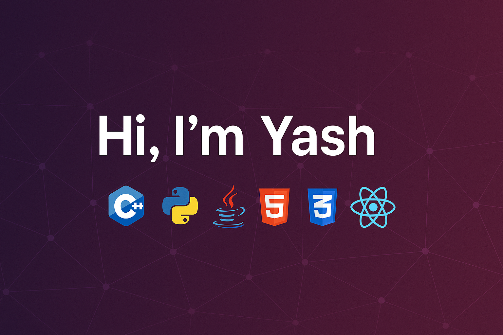

<!-- Profile Banner -->

  

<h1 align="center">Hi there, I'm Yash 👋</h1>

<!-- Typing animation -->

  

---

## 🛠 Tech Stack

---

## 📊 GitHub Stats

  
  

  

---

## 🌟 Featured Projects

  

---

## 📫 Let's Connect

---

<!--
**yashlokwani/yashlokwani** is a ✨ _special_ ✨ repository because its `README.md` (this file) appears on your GitHub profile.

Here are some ideas to get you started:

- 🔭 I’m currently working on ...
- 🌱 I’m currently learning ...
- 👯 I’m looking to collaborate on ...
- 🤔 I’m looking for help with ...
- 💬 Ask me about ...
- 📫 How to reach me: ...
- 😄 Pronouns: ...
- ⚡ Fun fact: ...
-->
